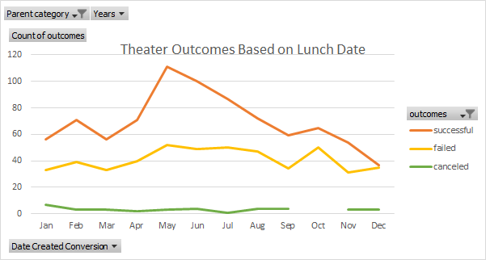
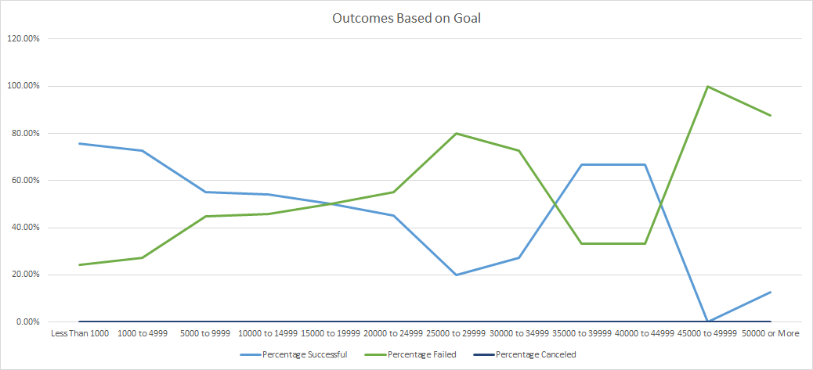

# Kickstarting with Excel

## Overview of Project

### Purpose

To help Louise who want to start a fund for her show , by finding out the highest success rate for starting a crowdfunding campaign.

## Analysis and Challenges

### Analysis of Outcomes Based on Launch Date
First of all, I used the Pivot Table and set the Parent category as a filter, so that this analysis can fourcs on the kistarters that relate to theater just like Louise's project.

Secondly, I set Date Created Conversion as rows, outcomes as columns and count of outcomes as values, in that way we could clearly understand the relation between month and amount of successful crowdfunding campaigns.

Finally, I created line chart for data visualizing. By looking this chart, we will find that durning late autumn(May,Jun) the amount of successful campaigns are the highest in the year.

In this project I found out that the language of cells stuck into Chinese, so instead of "Jan", I got "一月" for my Date Created Conversion data.

I tried change the language settings for Excel and Windows but still notworking, in the end, I have to fix the text one by one.

### Analysis of Outcomes Based on Goals
First of all, I created a sheet and 8 columns for recording every type of outcomes and other data that we are going to use.

Secondly, I used COUNTIFS function to fill out the Number Successful, Number Failed, and Number Canceled columns by filtering on the Goal and Subcategory.

Finally, I calculated the percentage of every type of outcome and make a line chart for data visualizing. By looking this chart, although the goal that has the highest percentage of success is less then 1000, consider that Louise need more than $10,000 budget, set the goal over 35000 will be more fit for her.

In this project I found out that COUNTIFS function needs double quote for the operater, I often forget to add double and make the mistake.

### Challenges and Difficulties Encountered

## Results

- What are two conclusions you can draw about the Outcomes based on Launch Date?
- First, it's better for Louise to start crowdfunding campaign in May or Jun, which give her 66% and 65% chance of success, respectfully.
- Second, on the other hand, she'd be better **NOT** to start crowdfunding campaign in Dec, which give her 49% chance of success, respectfully.

- What can you conclude about the Outcomes based on Goals?
- If Louise set the goal between 35000 and 44999 she could maximize the profits and get 66.67% successful rate.

- What are some limitations of this dataset?
- Amount of data is not enough for more accurate analysis.

- What are some other possible tables and/or graphs that we could create?
- Outcome based on country which could show which countries has the highest percentage of success for holding a crowdfunding campaign .
- Outcome based on staff pick. If we set staff pick as a factor, we could estimate how much percentage of success will increase.
- Outcome based on backers_count which could show the effect of backers.

To teachers: 

I'm from Taiwan, I just arrived States a month ago, I know my Engilsh is poor, but I promise you that I'll do my best and hopefully you will see my prograse.
